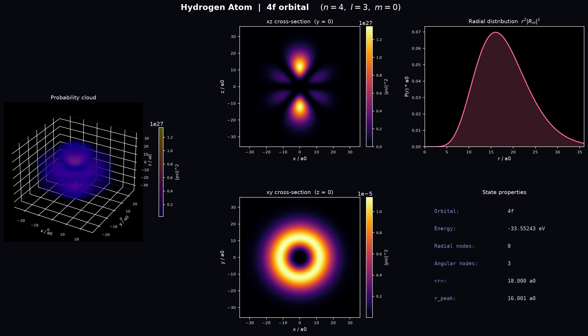
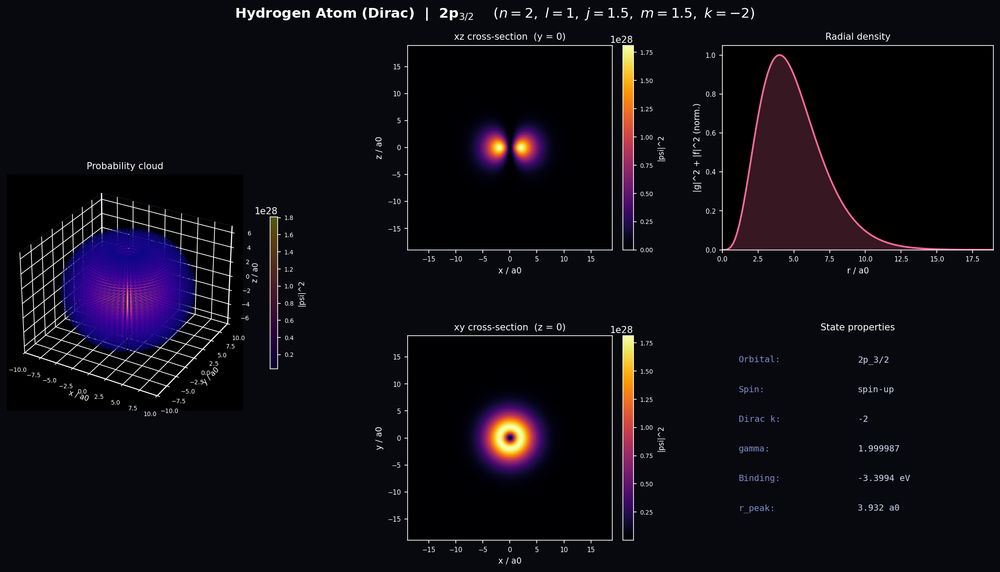
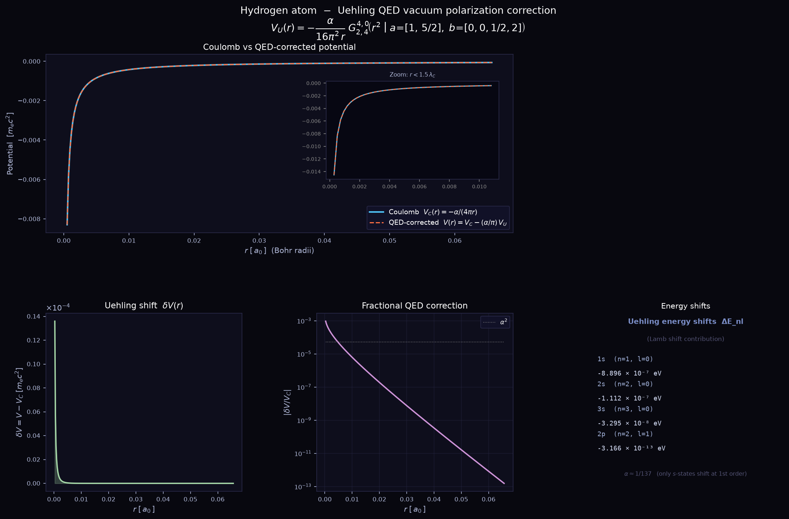

# Quantum

Three Python programs that model the hydrogen atom at increasing levels of
physical theory and visualize the electron probability distribution. Each one
solves a different equation, prints the properties of the chosen state, and
saves a labelled figure.

The three models form a natural ladder:

1. **Schrodinger** sets the non-relativistic baseline (orbital shapes and energies).
2. **Dirac** adds special relativity and electron spin (fine structure).
3. **Uehling** adds the leading QED correction (vacuum polarization).

## What is inside

| Script | Equation | What it shows |
| --- | --- | --- |
| [`Hydrogen_Atom_Schrodinger.py`](Hydrogen_Atom_Schrodinger.py) | Schrodinger | Exact non-relativistic wavefunction from associated Laguerre polynomials and spherical harmonics. 3D probability cloud, xz and xy cross-sections, radial distribution, and a state-properties table. |
| [`Hydrogen_Atom_Dirac.py`](Hydrogen_Atom_Dirac.py) | Dirac | Four-component relativistic spinor with spin and total angular momentum. 3D probability cloud, xz and xy cross-sections, radial density, and a state-properties table. |
| [`Hydrogen_Atom_Uehling.py`](Hydrogen_Atom_Uehling.py) | Dirac + QED | Uehling vacuum-polarization correction to the Coulomb potential, expressed exactly as a single Meijer G-function. Coulomb vs corrected potential, the shift, the fractional correction, and the Lamb-shift contributions. |

## Sample output

Schrodinger, 4f orbital (n = 4, l = 3, m = 0):



Dirac, 2p(3/2) state (n = 2, l = 1, j = 3/2, m = 3/2):



Uehling QED correction to the hydrogen potential:



## Running

The models need NumPy, SciPy, Matplotlib, and (for the Uehling model) mpmath.
The Schrodinger model uses `scipy.special.sph_harm_y`, which requires SciPy 1.15
or newer.

```bash
pip install -r requirements.txt
```

Each script is interactive and prompts for the quantum numbers of the state you
want to view:

```bash
python Hydrogen_Atom_Schrodinger.py    # asks for n, l, m
python Hydrogen_Atom_Dirac.py          # asks for n, l, then j and m from a menu
python Hydrogen_Atom_Uehling.py        # no input; the correction is state-independent at this order
```

A figure window opens and a PNG is written next to the script.

## Quantum number ranges

Both the Schrodinger and Dirac models cap the principal quantum number at
n = 11 (the highest named hydrogen series, Humphreys). The other numbers follow
the usual rules:

- `l` runs from 0 to n - 1.
- `m` (Schrodinger) runs from -l to l.
- `j` (Dirac) is l + 1/2 or, for l > 0, l - 1/2.
- `m` (Dirac) is the projection of j, running from -j to j in integer steps.

## References

- W. Greiner, *Relativistic Quantum Mechanics: Wave Equations*, 3rd ed. (Dirac model).
- J. J. Sakurai, *Advanced Quantum Mechanics* (Dirac model).
- Koegler and Schneider, [arXiv:2209.15020](https://arxiv.org/abs/2209.15020) (Uehling potential as a Meijer G-function).
- Frolov and Wardlaw, *Eur. Phys. J. B* **85**, 348 (2012), [arXiv:1110.3433](https://arxiv.org/abs/1110.3433) (closed-form Uehling result).

## License

Released under the MIT License. See [LICENSE](LICENSE).
